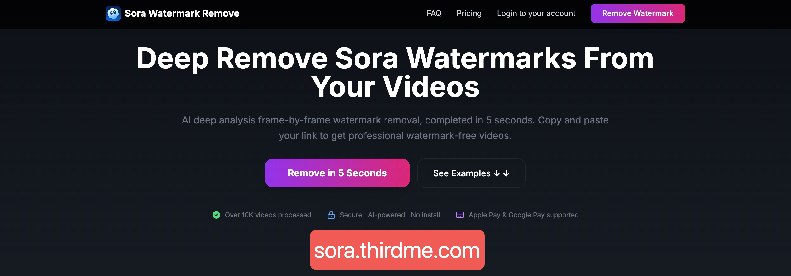

# Sora Watermark Remover - 5秒でSoraビデオの透かしを無料で除去

**Choose your language / 选择语言 / 言語を選択 / Choisissez votre langue**

## 🎯 製品紹介

Sora Watermark Removerは、**5秒で処理を完了**するプロフェッショナルなAI駆動のビデオ透かし除去ツールで、Soraで生成されたビデオの深層透かし除去に特化しています。先進的なニューラルネットワーク技術により、100%の精度で透かしを検出・除去し、ユーザーにプロフェッショナルグレードの透かしなしビデオを提供します。

🌐 **公式ウェブサイトデモ**: [https://sora.thirdme.com](https://sora.thirdme.com)

## 🚀 使用方法

### ステップ1：Soraビデオリンクを取得

#### Web方法：
1. [sora.chatgpt.com](https://sora.chatgpt.com) ウェブサイトを開く
2. 処理したいSora作品をクリックして開く
3. ブラウザのアドレスバーからURLをコピー
4. コピーしたリンクを私たちの入力ボックスに貼り付け

#### モバイル方法：
1. Soraアプリを開く
2. 処理したいSora作品を見つける
3. 右下の「...」ボタンをクリック
4. 「リンクをコピー」を選択
5. コピーしたリンクを私たちの入力ボックスに貼り付け

### ステップ2：透かし除去処理
1. 私たちのウェブサイトにアクセス：[https://sora.thirdme.com](https://sora.thirdme.com)
2. Soraビデオリンクを貼り付け
3. 「Sora透かしを除去」ボタンをクリック
4. AI分析・処理を待つ（**わずか5秒で完了**）

### ステップ3：透かしなしビデオをダウンロード
1. 処理完了後、透かしなしビデオを直接ダウンロード
2. 元の品質のプロフェッショナルグレードビデオを取得
3. ビデオは24時間後にサーバーから自動削除されます
